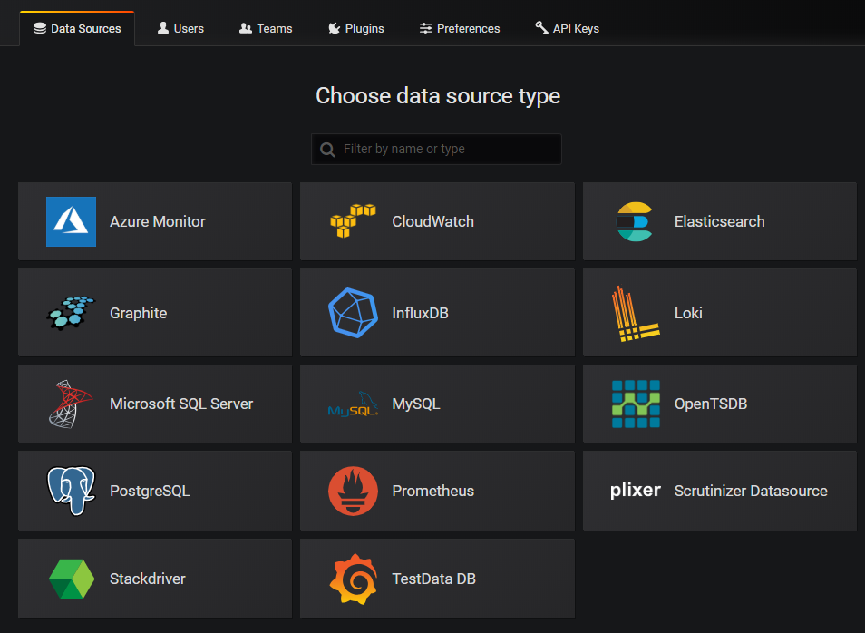

# Dokumentacja projektu z przedmiotu Środowiska Udostępniania Usług

## Temat projektu: MCP Grafana (akronim MCP-G)

## Autorzy:

- Mateusz Górski
- Mateusz Lampert
- Wojciech Michaluk
- Jan Pawlica

## Rok 2025/26, grupa 5 - piątek 13:15

## Spis treści

1. [Wprowadzenie](#rozdział-1-wprowadzenie)
   1. [Kubernetes](#kubernetes)
   2. [Grafana](#grafana)
2. [Podstawy teoretyczne i stos technologiczny](#rozdział-2-podstawy-teoretyczne-i-stos-technologiczny)
3. [Opis studium przypadku](#rozdział-3-opis-studium-przypadku)
4. [Architektura rozwiązania](#rozdział-4-architektura-rozwiązania)

## Rozdział 1: Wprowadzenie

### Kubernetes

Kubernetes (**K8s**) to otwartoźródłowa platforma, która ułatwia automatyzację wdrażania, skalowania
i zarządzania skonteneryzowanymi aplikacjami.
Jest to najpopularniejsze narzędzie w środowiskach DevOps do zarządzania złożonymi aplikacjami
rozproszonymi.
System ten pozwala na uruchamianie i zarządzanie setkami, a nawet tysiącami kontenerów.
Kubernetes cechuje się również samonaprawianiem (self-healing), czyli automatycznym restartem
wadliwych kontenerów, które uległy awarii, ewentualnie nawet ich wymianą w razie potrzeby.
Jego działanie opiera się na organizacji kontenerów w tzw. _pody_, czyli logiczne grupy, co ułatwia
zarządzanie aplikacją.

Warto wspomnieć, czym Kubernetes **nie jest**, aby dostrzec pełnię jego zalet.
Nie jest to tradycyjny, "zawierający wszystko" system _Platform as a Service_ (PaaS), ale posiada
funkcjonalności ogólnego zastosowania, które cechują rozwiązania tego typu.
Obejmują one instalacje (_deployments_), a także skalowanie i balansowanie ruchu, co umożliwia
użytkownikom integrację rozwiązań służących do logowania, monitoringu i ostrzegania.
Kubernetes również **nie jest monolitem** - dostarcza elementy, z których można zbudować aplikację,
ale są one opcjonalne i funkcjonują na zasadzie wtyczek.
Pozostawia to użytkownikowi wybór i elastyczność, bowiem Kubernetes:

- nie ogranicza obsługiwanych typów aplikacji,
- nie wymusza użycia konkretnych systemów zbierania logów, monitorowania ani ostrzegania,
- eliminuje konieczność orchestracji i scentralizowanego zarządzania.

### Grafana

Grafana to popularna, również otwartoźródłowa platforma, która służy do wizualizacji danych,
monitorowania infrastruktury IT oraz analizy w czasie rzeczywistym.
Umożliwia tworzenie interaktywnych dashboardów z np. wykresami, panelami i alertami, a także
integrację danych z różnych źródeł, m.in. Prometheus, InfluxDB, MySQL czy ElasticSearch.
Rysunek poniżej ([źródło](https://grafana-docs.readthedocs.io/en/latest/ds_adddatasource.html)) przedstawia panel wyboru źródła danych w Grafanie, obejmujący wiele popularnych
baz danych i rozwiązań chmurowych.

Kluczowe cechy i zastosowania Grafany obejmują:

- wizualizację złożonych danych z wykorzystaniem szerokiej gamy wykresów (np. słupkowe, liniowe,
  _heatmapy_),
- wsparcie dla wielu źródeł danych (patrz rysunek powyżej),
- monitorowanie w czasie rzeczywistym - np. śledzenie wydajności serwerów, aplikacji i usług,
- alerty - powiadomienia dotyczące m.in. anomalii czy przekroczeniu ustalonych progów,
- elastyczność - możliwość działania na serwerach lokalnych oraz w chmurze, rozbudowa przez wtyczki.

## Rozdział 2: Podstawy teoretyczne i stos technologiczny

## Rozdział 3: Opis studium przypadku

## Rozdział 4: Architektura rozwiązania

