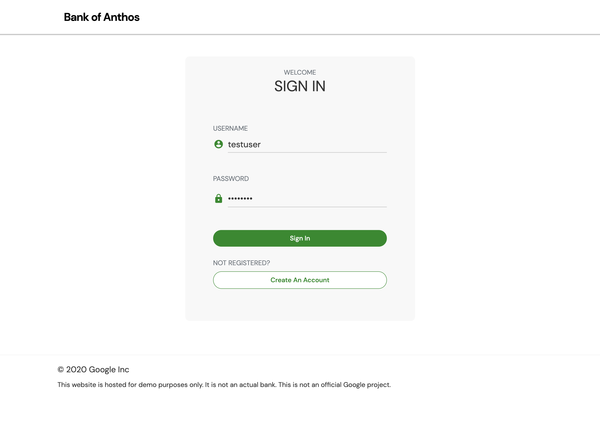
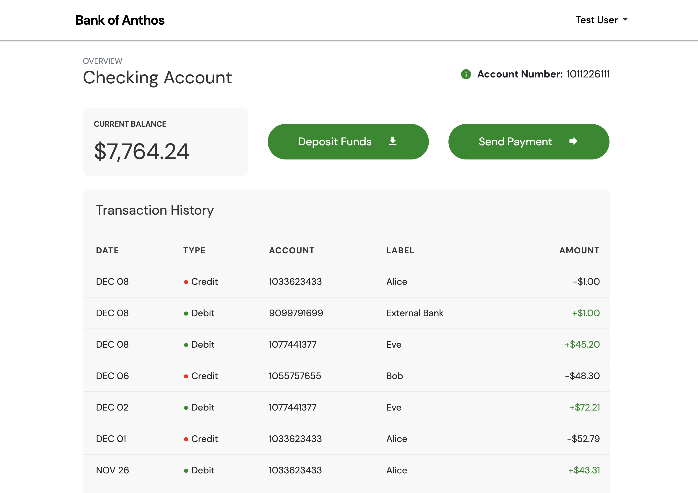
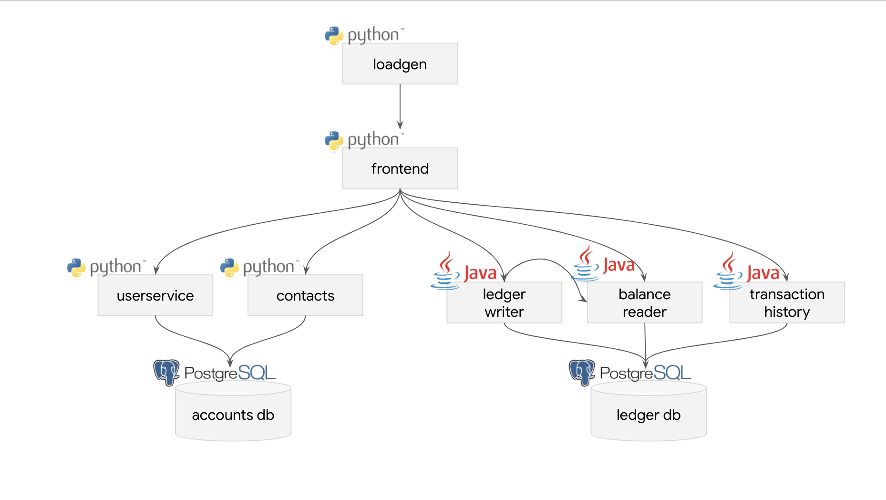

# Dokumentacja projektu z przedmiotu Środowiska Udostępniania Usług

## Temat projektu: MCP Grafana (akronim MCP-G)

## Autorzy:

- Mateusz Górski
- Mateusz Lampert
- Wojciech Michaluk
- Jan Pawlica

## Rok 2025/26, grupa 5 - piątek 13:15

## Spis treści

1. [Wprowadzenie](#rozdział-1-wprowadzenie)
   1. [Kubernetes](#kubernetes)
   2. [Grafana](#grafana)
   3. [MCP](#mcp)
2. [Podstawy teoretyczne i stos technologiczny](#rozdział-2-podstawy-teoretyczne-i-stos-technologiczny)
   1. [Podstawy teoretyczne](#podstawy-teoretyczne)
      1. [Monitorowanie i obserwowalność](#monitorowanie-i-obserwowalność)
      2. [Integracja LLM z Grafaną przez MCP](#integracja-llm-z-grafaną-przez-mcp)
   2. [Stos technologiczny](#stos-technologiczny)
      1. [Google Cloud Platform (GCP)](#google-cloud-platform-gcp)
      2. [Docker](#docker)
      3. [Prometheus](#prometheus)
      4. [Serwer MCP Grafany](#serwer-mcp-grafany)
      5. [OpenAI GPT-4o](#openai-gpt-4o)
      6. [Locust](#locust)
3. [Opis studium przypadku](#rozdział-3-opis-studium-przypadku)
   1. [Wykorzystana aplikacja](#wykorzystana-aplikacja)
   2. [Komponenty aplikacji](#komponenty-aplikacji)
   3. [Scenariusze testowania aplikacji](#scenariusze-testowania-aplikacji)
4. [Architektura rozwiązania](#rozdział-4-architektura-rozwiązania)
5. [Konfiguracja środowiska](#rozdział-5-konfiguracja-środowiska)
6. [Sposób instalacji](#rozdział-6-sposób-instalacji)
7. [Etapy wdrażania demo](#rozdział-7-etapy-wdrażania-demo)
   1. [Konfiguracja](#konfiguracja)
   2. [Przygotowanie danych](#przygotowanie-danych)
8. [Opis demo](#rozdział-8-opis-demo)
   1. [Procedura wykonania](#procedura-wykonania)
   2. [Wyniki](#wyniki)
9. [Podsumowanie i wnioski](#rozdział-9-podsumowanie-i-wnioski)
10. [Referencje](#rozdział-10-referencje)

## Rozdział 1: Wprowadzenie

Celem tego projektu jest demonstracja wykorzystania serwera MCP dla Grafany do sterowania aplikacją
Grafany z poziomu wybranego modelu LLM.
Aplikacja demonstracyjna powinna zostać wdrożona w klastrze Kubernetesa w celu generowania danych
wizualizowanych przez Grafanę.

### Kubernetes

Kubernetes (**K8s**) to otwartoźródłowa platforma, która ułatwia automatyzację wdrażania, skalowania
i zarządzania skonteneryzowanymi aplikacjami.
Jest to najpopularniejsze narzędzie w środowiskach DevOps do zarządzania złożonymi aplikacjami
rozproszonymi.
System ten pozwala na uruchamianie i zarządzanie setkami, a nawet tysiącami kontenerów.
Kubernetes cechuje się również samonaprawianiem (self-healing), czyli automatycznym restartem
wadliwych kontenerów, które uległy awarii, ewentualnie nawet ich wymianą w razie potrzeby.
Jego działanie opiera się na organizacji kontenerów w tzw. _pody_, czyli logiczne grupy, co ułatwia
zarządzanie aplikacją.

Warto wspomnieć, czym Kubernetes **nie jest**, aby dostrzec pełnię jego zalet.
Nie jest to tradycyjny, "zawierający wszystko" system _Platform as a Service_ (PaaS), ale posiada
funkcjonalności ogólnego zastosowania, które cechują rozwiązania tego typu.
Obejmują one instalacje (_deployments_), a także skalowanie i balansowanie ruchu, co umożliwia
użytkownikom integrację rozwiązań służących do logowania, monitoringu i ostrzegania.
Kubernetes również **nie jest monolitem** - dostarcza elementy, z których można zbudować aplikację,
ale są one opcjonalne i funkcjonują na zasadzie wtyczek.
Pozostawia to użytkownikowi wybór i elastyczność, bowiem Kubernetes:

- nie ogranicza obsługiwanych typów aplikacji,
- nie wymusza użycia konkretnych systemów zbierania logów, monitorowania ani ostrzegania,
- eliminuje konieczność orchestracji i scentralizowanego zarządzania.

### Grafana

Grafana to popularna, również otwartoźródłowa platforma, która służy do wizualizacji danych,
monitorowania infrastruktury IT oraz analizy w czasie rzeczywistym.
Umożliwia tworzenie interaktywnych dashboardów z np. wykresami, panelami i alertami, a także
integrację danych z różnych źródeł, m.in. Prometheus, InfluxDB, MySQL czy ElasticSearch.
Rysunek poniżej ([źródło](https://grafana-docs.readthedocs.io/en/latest/ds_adddatasource.html)) przedstawia panel wyboru źródła danych w Grafanie, obejmujący wiele popularnych
baz danych i rozwiązań chmurowych.

Kluczowe cechy i zastosowania Grafany obejmują:

- wizualizację złożonych danych z wykorzystaniem szerokiej gamy wykresów (np. słupkowe, liniowe,
  _heatmapy_),
- wsparcie dla wielu źródeł danych (patrz rysunek powyżej),
- monitorowanie w czasie rzeczywistym - np. śledzenie wydajności serwerów, aplikacji i usług,
- alerty - powiadomienia dotyczące m.in. anomalii czy przekroczeniu ustalonych progów,
- elastyczność - możliwość działania na serwerach lokalnych oraz w chmurze, rozbudowa przez wtyczki.

### MCP

MCP, czyli _Model Context Protocol_, to otwarty standard technologiczny, który umożliwia modelom LLM
łączyć się w bezpieczny sposób z zewnętrznymi danymi, bazami danych oraz narzędziami programistycznymi.
Dzięki temu zyskał dużą popularność, bo rozwiązał kluczowy problem braku standaryzacji w łączeniu
modeli z zewnętrznymi danymi i narzędziami.
Ułatwia zarządzanie uprawnieniami dzięki ustrukturyzowanemu dostępowi do danych.
MCP działa w modelu klient-serwer.
Serwer udostępnia zasoby (dane), narzędzia oraz prompty, które pełnią rolę reużywalnych szablonów,
instrukcji, z kolei klienci odkrywają i wykorzystują te elementy udostępniane przez serwery.
Każdy klient utrzymuje połączenie 1:1 z poszczególnym serwerem.
Całość jest zarządzana przez _hosta_, który pełni rolę koordynatora - tworzy i obsługuje wiele
instancji klienta.

## Rozdział 2: Podstawy teoretyczne i stos technologiczny

### Podstawy teoretyczne

#### Monitorowanie i obserwowalność

Monitorowanie aplikacji w środowiskach chmurowych polega na zbieraniu i analizie danych
telemetrycznych. Kluczowym pojęciem jest tutaj _obserwowalność_ (ang. _observability_), czyli
zdolność do wnioskowania o wewnętrznym stanie systemu na podstawie jego zewnętrznych sygnałów.
Wyróżnia się trzy filary obserwowalności:

- **metrics** - numeryczne wartości reprezentujące stan systemu w czasie (np. użycie CPU,
  liczba żądań na sekundę, opóźnienie odpowiedzi),
- **logs** - tekstowe zapisy zdarzeń generowane przez aplikacje,
- **traces** - rejestracja przepływu żądań przez poszczególne komponenty systemu.

W projekcie skupiamy się przede wszystkim na metrykach zbieranych przez Prometheusa
i wizualizowanych w Grafanie.

#### Integracja LLM z Grafaną przez MCP

Dedykowany serwer MCP umożliwia modelowi językowemu sterowanie Grafaną —
przeglądanie dashboardów, odpytywanie źródeł danych czy tworzenie alertów.
Przepływ komunikacji wygląda następująco:

1. Użytkownik wysyła zapytanie w języku naturalnym do modelu LLM.
2. Model rozpoznaje intencję i wywołuje odpowiednie narzędzie udostępniane przez serwer MCP.
3. Serwer MCP Grafany wykonuje operację (np. odpytuje Prometheusa) i zwraca wynik.
4. Model LLM interpretuje wynik i odpowiada użytkownikowi w języku naturalnym.

### Stos technologiczny

Poniżej opisano narzędzia wykorzystane w projekcie. Kubernetes, Grafana oraz MCP zostały
przedstawione w rozdziale 1.

#### Google Cloud Platform (GCP)

Infrastruktura chmurowa projektu opiera się na platformie Google Cloud Platform.
W ramach projektu wykorzystamy bezpłatne środki w wysokości 300 USD oferowane przez Google nowym użytkownikom.
GCP zapewnia klaster Kubernetes poprzez usługę Google Kubernetes Engine (GKE), która automatyzuje
zarządzanie węzłami klastra, aktualizacje oraz skalowanie.

#### Docker

Docker jest podstawą konteneryzacji wszystkich komponentów systemu.
Mikroserwisy aplikacji oraz narzędzia monitoringowe pakowane są jako obrazy
kontenerowe zgodne ze standardem OCI.
Kubernetes zarządza następnie cyklem życia tych kontenerów w klastrze.

#### Prometheus

Prometheus to otwartoźródłowy system monitorowania i alarmowania, stanowiący standard
w ekosystemie Kubernetes.
Działa w modelu _pull_ - cyklicznie pobiera (_scrape_) metryki z endpointów HTTP udostępnianych przez
monitorowane aplikacje.
Zebrane metryki przechowuje w wbudowanej bazie danych szeregów czasowych i udostępnia je
poprzez język zapytań PromQL.
W projekcie Prometheus zbiera metryki ze wszystkich mikroserwisów aplikacji.

#### Serwer MCP Grafany

Serwer MCP Grafany to osobny projekt otwartoźródłowy, który łączy się z Grafaną przez jej HTTP API.
Udostępnia narzędzia pozwalające modelom LLM na sterowanie Grafaną — odpytywanie źródeł danych,
zarządzanie dashboardami czy analizę metryk.

#### OpenAI GPT-4o

GPT-4o to model językowy firmy OpenAI wykorzystywany w projekcie do komunikacji z Grafaną
przez protokół MCP. Interpretuje dane monitoringowe i odpowiada użytkownikowi w języku naturalnym.
Wybór dostawcy i modelu może ulec zmianie w trakcie realizacji projektu.

#### Locust

Locust to otwartoźródłowe narzędzie do testów obciążeniowych napisane w języku Python.
Pozwala na symulowanie zachowania wielu równoczesnych użytkowników wysyłających żądania HTTP
do testowanej aplikacji.
W projekcie Locust generuje syntetyczny ruch użytkowników, który umożliwia obserwację
zachowania systemu pod obciążeniem w Grafanie.

## Rozdział 3: Opis studium przypadku

### Wykorzystana aplikacja

Aplikacją wykorzystaną w niniejszym projekcie jest Bank of Anthos, czyli referencyjna aplikacja mikroserwisowa opracowana
przez Google, służąca do demonstracji praktyk związanych z wdrażaniem, monitorowaniem oraz analizą aplikacji w
środowiskach chmurowych.
Bank of Anthos symuluje działanie systemu bankowego, umożliwiając użytkownikom wykonywanie podstawowych operacji
finansowych, takich jak przeglądanie salda konta, wykonywanie przelewów i zarządzanie historią transakcji.

| Login                      | Strona główna                                 |
|----------------------------|-----------------------------------------------|
|  |  |

Aplikacja działa w środowisku Kubernetes i jest uruchamiana jako zestaw kontenerów,
a cały projekt został zaprojektowany w architekturze mikroserwisowej i składa się z wielu niezależnych komponentów
widocznych poniżej:

### Komponenty aplikacji

| Serwis              | Język           | Opis                                                                                                         |
|---------------------|-----------------|--------------------------------------------------------------------------------------------------------------|
| loadgenerator       | Python / Locust | Generuje ruch w systemie, symulując zachowanie użytkowników (tworzenie kont, wykonywanie transakcji).        |
| frontend            | Python          | Udostępnia serwer HTTP obsługujący interfejs użytkownika (strona logowania, rejestracji oraz strona główna). |
| user-service        | Python          | Zarządza kontami użytkowników oraz uwierzytelnianiem. Generuje tokeny JWT wykorzystywane przez inne serwisy. |
| contacts            | Python          | Przechowuje listę kontaktów użytkownika wykorzystywaną np. przy wykonywaniu przelewów.                       |
| accounts-db         | PostgreSQL      | Baza danych przechowująca dane użytkowników. Może być wstępnie zasilona danymi demonstracyjnymi.             |
| ledger-writer       | Java            | Przyjmuje i waliduje transakcje, a następnie zapisuje je w rejestrze (ledger).                               |
| balance-reader      | Java            | Zapewnia szybki dostęp do aktualnych sald użytkowników na podstawie danych z bazy ledger-db.                 |
| transaction-history | Java            | Udostępnia historię transakcji użytkownika na podstawie danych z bazy ledger-db.                             |
| ledger-db           | PostgreSQL      | Baza danych przechowująca wszystkie transakcje (ledger). Może być wstępnie zasilona danymi demonstracyjnymi. |

---

### Scenariusze testowania aplikacji

W ramach prezentacji działania systemu przewidziano następujące scenariusze testowe dla aplikacji:

1. Normalne działanie aplikacji
    - niski poziom ruchu
    - standardowe operacje użytkownika

2. Zwiększone obciążenie
    - stopniowe zwiększanie liczby użytkowników
    - intensyfikacja wykonywanych operacji

3. Przeciążenie systemu
    - nagłe zwiększenie liczby użytkowników,
    - bardzo intensywne obciążenie wszystkich serwisów.

4. Awaria komponentu
    - wyłączenie jednego z kluczowych serwisów
    - dalsze generowanie ruchu

5. Skalowanie aplikacji
    - zwiększenie ruchu przy włączonym autoscalingu w Kubernetesie

Na podstawie powyższych scenariuszy generowane będą dane telemetryczne, które będą zbierane przez Prometheusa oraz wizualizowane w Grafanie.

## Rozdział 4: Architektura rozwiązania

## Rozdział 5: Konfiguracja środowiska

## Rozdział 6: Sposób instalacji

## Rozdział 7: Etapy wdrażania demo

### Konfiguracja

### Przygotowanie danych

## Rozdział 8: Opis demo

### Procedura wykonania

### Wyniki

## Rozdział 9: Podsumowanie i wnioski

## Rozdział 10: Referencje
