# Dokumentacja projektu z przedmiotu Środowiska Udostępniania Usług

## Temat projektu: MCP Grafana (akronim MCP-G)

## Autorzy:

- Mateusz Górski
- Mateusz Lampert
- Wojciech Michaluk
- Jan Pawlica

## Rok 2025/26, grupa 5 - piątek 13:15

## Spis treści

1. [Wprowadzenie](#rozdział-1-wprowadzenie)
   1. [Kubernetes](#kubernetes)
   2. [Grafana](#grafana)
   3. [MCP](#mcp)
2. [Podstawy teoretyczne i stos technologiczny](#rozdział-2-podstawy-teoretyczne-i-stos-technologiczny)
   1. [Podstawy teoretyczne](#podstawy-teoretyczne)
      1. [Monitorowanie i obserwowalność](#monitorowanie-i-obserwowalność)
      2. [Integracja LLM z Grafaną przez MCP](#integracja-llm-z-grafaną-przez-mcp)
   2. [Stos technologiczny](#stos-technologiczny)
      1. [Google Cloud Platform (GCP)](#google-cloud-platform-gcp)
      2. [Docker](#docker)
      3. [Prometheus](#prometheus)
      4. [Serwer MCP Grafany](#serwer-mcp-grafany)
      5. [OpenAI GPT-4o](#openai-gpt-4o)
      6. [Locust](#locust)
3. [Opis studium przypadku](#rozdział-3-opis-studium-przypadku)
   1. [Wykorzystana aplikacja](#wykorzystana-aplikacja)
   2. [Komponenty aplikacji](#komponenty-aplikacji)
   3. [Scenariusze testowania aplikacji](#scenariusze-testowania-aplikacji)
4. [Architektura rozwiązania](#rozdział-4-architektura-rozwiązania)
5. [Opis środowiska](#rozdział-5-opis-środowiska)
   1. [Ekosystem Google Cloud Platform (GCP)](#ekosystem-google-cloud-platform-gcp)
   2. [Bank of Anthos jako referencyjne środowisko](#bank-of-anthos-jako-referencyjne-środowisko)
6. [Sposób instalacji demo](#rozdział-6-sposób-instalacji-demo)
   1. [Uruchomienie samouczka](#uruchomienie-samouczka)
   2. [Wczytanie środowiska i utworzenie projektu](#wczytanie-środowiska-i-utworzenie-projektu)
   3. [Konfiguracja klastra Kubernetesa](#konfiguracja-klastra-kubernetesa)
   4. [Wdrożenie tokenu JWT](#wdrożenie-tokenu-jwt)
   5. [Uruchomienie aplikacji w klastrze Kubernetesa](#uruchomienie-aplikacji-w-klastrze-kubernetesa)
7. [Integracja Prometheusa, Grafany i serwera MCP](#rozdział-7-integracja-prometheusa-grafany-i-serwera-mcp)
   1. [Integracja Prometheusa](#integracja-prometheusa)
   2. [Integracja Grafany](#integracja-grafany)
   3. [Integracja serwera MCP](#integracja-serwera-mcp)
8. [Przedstawienie działania aplikacji](#rozdział-8-przedstawienie-działania-aplikacji)
   1. [Przebieg wykonania](#przebieg-wykonania)
   2. [Wyniki](#wyniki)
9. [Podsumowanie i wnioski](#rozdział-9-podsumowanie-i-wnioski)
10. [Referencje](#rozdział-10-referencje)

## Rozdział 1: Wprowadzenie

Celem tego projektu jest demonstracja wykorzystania serwera MCP dla Grafany do sterowania aplikacją
Grafany z poziomu wybranego modelu LLM.
Aplikacja demonstracyjna powinna zostać wdrożona w klastrze Kubernetesa w celu generowania danych
wizualizowanych przez Grafanę.

### Kubernetes

Kubernetes (**K8s**) to otwartoźródłowa platforma, która ułatwia automatyzację wdrażania, skalowania
i zarządzania skonteneryzowanymi aplikacjami.
Jest to najpopularniejsze narzędzie w środowiskach DevOps do zarządzania złożonymi aplikacjami
rozproszonymi.
System ten pozwala na uruchamianie i zarządzanie setkami, a nawet tysiącami kontenerów.
Kubernetes cechuje się również samonaprawianiem (self-healing), czyli automatycznym restartem
wadliwych kontenerów, które uległy awarii, ewentualnie nawet ich wymianą w razie potrzeby.
Jego działanie opiera się na organizacji kontenerów w tzw. _pody_, czyli logiczne grupy, co ułatwia
zarządzanie aplikacją.

Warto wspomnieć, czym Kubernetes **nie jest**, aby dostrzec pełnię jego zalet.
Nie jest to tradycyjny, "zawierający wszystko" system _Platform as a Service_ (PaaS), ale posiada
funkcjonalności ogólnego zastosowania, które cechują rozwiązania tego typu.
Obejmują one instalacje (_deployments_), a także skalowanie i balansowanie ruchu, co umożliwia
użytkownikom integrację rozwiązań służących do logowania, monitoringu i ostrzegania.
Kubernetes również **nie jest monolitem** - dostarcza elementy, z których można zbudować aplikację,
ale są one opcjonalne i funkcjonują na zasadzie wtyczek.
Pozostawia to użytkownikowi wybór i elastyczność, bowiem Kubernetes:

- nie ogranicza obsługiwanych typów aplikacji,
- nie wymusza użycia konkretnych systemów zbierania logów, monitorowania ani ostrzegania,
- eliminuje konieczność orchestracji i scentralizowanego zarządzania.

### Grafana

Grafana to popularna, również otwartoźródłowa platforma, która służy do wizualizacji danych,
monitorowania infrastruktury IT oraz analizy w czasie rzeczywistym.
Umożliwia tworzenie interaktywnych dashboardów z np. wykresami, panelami i alertami, a także
integrację danych z różnych źródeł, m.in. Prometheus, InfluxDB, MySQL czy ElasticSearch.
Rysunek poniżej ([źródło](https://grafana-docs.readthedocs.io/en/latest/ds_adddatasource.html)) przedstawia panel wyboru źródła danych w Grafanie, obejmujący wiele popularnych
baz danych i rozwiązań chmurowych.
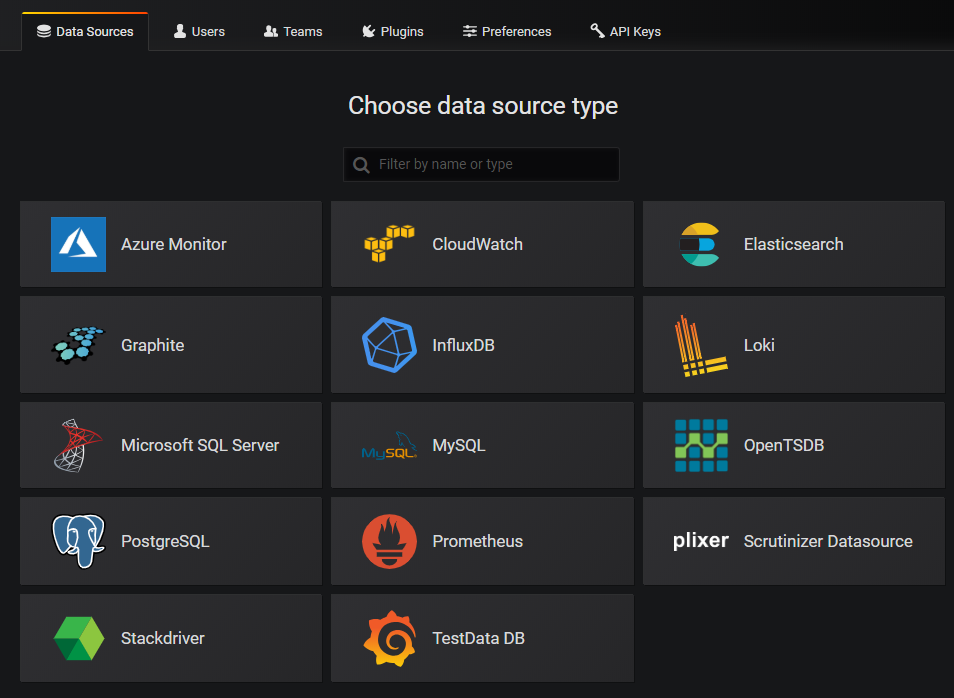

Kluczowe cechy i zastosowania Grafany obejmują:

- wizualizację złożonych danych z wykorzystaniem szerokiej gamy wykresów (np. słupkowe, liniowe,
  _heatmapy_),
- wsparcie dla wielu źródeł danych (patrz rysunek powyżej),
- monitorowanie w czasie rzeczywistym - np. śledzenie wydajności serwerów, aplikacji i usług,
- alerty - powiadomienia dotyczące m.in. anomalii czy przekroczeniu ustalonych progów,
- elastyczność - możliwość działania na serwerach lokalnych oraz w chmurze, rozbudowa przez wtyczki.

### MCP

MCP, czyli _Model Context Protocol_, to otwarty standard technologiczny, który umożliwia modelom LLM
łączyć się w bezpieczny sposób z zewnętrznymi danymi, bazami danych oraz narzędziami programistycznymi.
Dzięki temu zyskał dużą popularność, bo rozwiązał kluczowy problem braku standaryzacji w łączeniu
modeli z zewnętrznymi danymi i narzędziami.
Ułatwia zarządzanie uprawnieniami dzięki ustrukturyzowanemu dostępowi do danych.
MCP działa w modelu klient-serwer.
Serwer udostępnia zasoby (dane), narzędzia oraz prompty, które pełnią rolę reużywalnych szablonów,
instrukcji, z kolei klienci odkrywają i wykorzystują te elementy udostępniane przez serwery.
Każdy klient utrzymuje połączenie 1:1 z poszczególnym serwerem.
Całość jest zarządzana przez _hosta_, który pełni rolę koordynatora - tworzy i obsługuje wiele
instancji klienta.

## Rozdział 2: Podstawy teoretyczne i stos technologiczny

### Podstawy teoretyczne

#### Monitorowanie i obserwowalność

Monitorowanie aplikacji w środowiskach chmurowych polega na zbieraniu i analizie danych
telemetrycznych. Kluczowym pojęciem jest tutaj _obserwowalność_ (ang. _observability_), czyli
zdolność do wnioskowania o wewnętrznym stanie systemu na podstawie jego zewnętrznych sygnałów.
Wyróżnia się trzy filary obserwowalności:

- **metrics** - numeryczne wartości reprezentujące stan systemu w czasie (np. użycie CPU,
  liczba żądań na sekundę, opóźnienie odpowiedzi),
- **logs** - tekstowe zapisy zdarzeń generowane przez aplikacje,
- **traces** - rejestracja przepływu żądań przez poszczególne komponenty systemu.

W projekcie skupiamy się przede wszystkim na metrykach zbieranych przez Prometheusa
i wizualizowanych w Grafanie.

#### Integracja LLM z Grafaną przez MCP

Dedykowany serwer MCP umożliwia modelowi językowemu sterowanie Grafaną —
przeglądanie dashboardów, odpytywanie źródeł danych czy tworzenie alertów.
Przepływ komunikacji wygląda następująco:

1. Użytkownik wysyła zapytanie w języku naturalnym do modelu LLM.
2. Model rozpoznaje intencję i wywołuje odpowiednie narzędzie udostępniane przez serwer MCP.
3. Serwer MCP Grafany wykonuje operację (np. odpytuje Prometheusa) i zwraca wynik.
4. Model LLM interpretuje wynik i odpowiada użytkownikowi w języku naturalnym.

### Stos technologiczny

Poniżej opisano narzędzia wykorzystane w projekcie. Kubernetes, Grafana oraz MCP zostały
przedstawione w rozdziale 1.

#### Google Cloud Platform (GCP)

Infrastruktura chmurowa projektu opiera się na platformie Google Cloud Platform.
W ramach projektu wykorzystamy bezpłatne środki w wysokości 300 USD oferowane przez Google nowym użytkownikom.
GCP zapewnia klaster Kubernetes poprzez usługę Google Kubernetes Engine (GKE), która automatyzuje
zarządzanie węzłami klastra, aktualizacje oraz skalowanie.

#### Docker

Docker jest podstawą konteneryzacji wszystkich komponentów systemu.
Mikroserwisy aplikacji oraz narzędzia monitoringowe pakowane są jako obrazy
kontenerowe zgodne ze standardem OCI.
Kubernetes zarządza następnie cyklem życia tych kontenerów w klastrze.

#### Prometheus

Prometheus to otwartoźródłowy system monitorowania i alarmowania, stanowiący standard
w ekosystemie Kubernetes.
Działa w modelu _pull_ - cyklicznie pobiera (_scrape_) metryki z endpointów HTTP udostępnianych przez
monitorowane aplikacje.
Zebrane metryki przechowuje we wbudowanej bazie danych szeregów czasowych i udostępnia je
poprzez język zapytań PromQL.
W projekcie Prometheus zbiera metryki ze wszystkich mikroserwisów aplikacji.

#### Serwer MCP Grafany

Serwer MCP Grafany to osobny projekt otwartoźródłowy, który łączy się z Grafaną przez jej HTTP API.
Udostępnia narzędzia pozwalające modelom LLM na sterowanie Grafaną — odpytywanie źródeł danych,
zarządzanie dashboardami czy analizę metryk.

#### OpenAI GPT-4o

GPT-4o to model językowy firmy OpenAI wykorzystywany w projekcie do komunikacji z Grafaną
przez protokół MCP. Interpretuje dane monitoringowe i odpowiada użytkownikowi w języku naturalnym.
Wybór dostawcy i modelu może ulec zmianie w trakcie realizacji projektu.

#### Locust

Locust to otwartoźródłowe narzędzie do testów obciążeniowych napisane w języku Python.
Pozwala na symulowanie zachowania wielu równoczesnych użytkowników wysyłających żądania HTTP
do testowanej aplikacji.
W projekcie Locust generuje syntetyczny ruch użytkowników, który umożliwia obserwację
zachowania systemu pod obciążeniem w Grafanie.

## Rozdział 3: Opis studium przypadku

### Wykorzystana aplikacja

Aplikacją wykorzystaną w niniejszym projekcie jest Bank of Anthos, czyli referencyjna aplikacja mikroserwisowa opracowana
przez Google, służąca do demonstracji praktyk związanych z wdrażaniem, monitorowaniem oraz analizą aplikacji w
środowiskach chmurowych.
Bank of Anthos symuluje działanie systemu bankowego, umożliwiając użytkownikom wykonywanie podstawowych operacji
finansowych, takich jak przeglądanie salda konta, wykonywanie przelewów i zarządzanie historią transakcji.

| Login                      | Strona główna                                 |
|----------------------------|-----------------------------------------------|
| 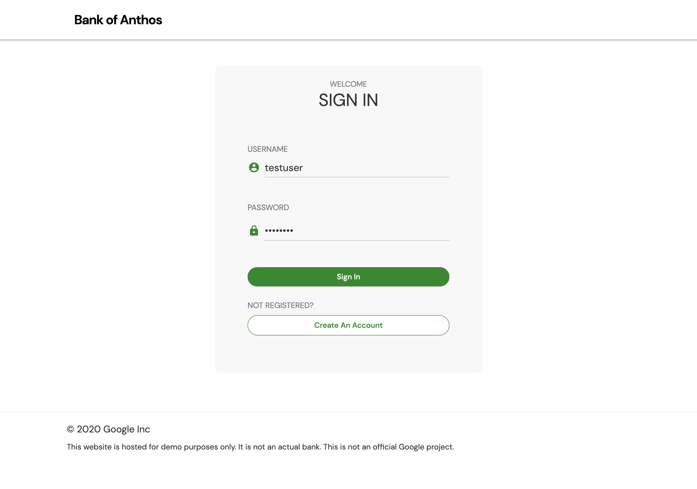 |  |

Aplikacja działa w środowisku Kubernetes i jest uruchamiana jako zestaw kontenerów,
a cały projekt został zaprojektowany w architekturze mikroserwisowej i składa się z wielu niezależnych komponentów
widocznych poniżej:


### Komponenty aplikacji

| Serwis              | Język           | Opis                                                                                                         |
|---------------------|-----------------|--------------------------------------------------------------------------------------------------------------|
| loadgenerator       | Python / Locust | Generuje ruch w systemie, symulując zachowanie użytkowników (tworzenie kont, wykonywanie transakcji).        |
| frontend            | Python          | Udostępnia serwer HTTP obsługujący interfejs użytkownika (strona logowania, rejestracji oraz strona główna). |
| user-service        | Python          | Zarządza kontami użytkowników oraz uwierzytelnianiem. Generuje tokeny JWT wykorzystywane przez inne serwisy. |
| contacts            | Python          | Przechowuje listę kontaktów użytkownika wykorzystywaną np. przy wykonywaniu przelewów.                       |
| accounts-db         | PostgreSQL      | Baza danych przechowująca dane użytkowników. Może być wstępnie zasilona danymi demonstracyjnymi.             |
| ledger-writer       | Java            | Przyjmuje i waliduje transakcje, a następnie zapisuje je w rejestrze (ledger).                               |
| balance-reader      | Java            | Zapewnia szybki dostęp do aktualnych sald użytkowników na podstawie danych z bazy ledger-db.                 |
| transaction-history | Java            | Udostępnia historię transakcji użytkownika na podstawie danych z bazy ledger-db.                             |
| ledger-db           | PostgreSQL      | Baza danych przechowująca wszystkie transakcje (ledger). Może być wstępnie zasilona danymi demonstracyjnymi. |

---

### Scenariusze testowania aplikacji

W ramach prezentacji działania systemu przewidziano następujące scenariusze testowe dla aplikacji:

1. Normalne działanie aplikacji
    - niski poziom ruchu
    - standardowe operacje użytkownika

2. Zwiększone obciążenie
    - stopniowe zwiększanie liczby użytkowników
    - intensyfikacja wykonywanych operacji

3. Przeciążenie systemu
    - nagłe zwiększenie liczby użytkowników,
    - bardzo intensywne obciążenie wszystkich serwisów.

4. Awaria komponentu
    - wyłączenie jednego z kluczowych serwisów
    - dalsze generowanie ruchu

5. Skalowanie aplikacji
    - zwiększenie ruchu przy włączonym autoscalingu w Kubernetesie

Na podstawie powyższych scenariuszy generowane będą dane telemetryczne, które będą zbierane przez Prometheusa oraz wizualizowane w Grafanie.

## Rozdział 4: Architektura rozwiązania


## Rozdział 5: Opis środowiska

### Ekosystem Google Cloud Platform (GCP)

W realizacji projektu wykorzystujemy środowisko Google Cloud Platform.
Wybór GCP jako fundamentu projektu podyktowany był natywnym wsparciem dla technologii kontenerowych i analitycznych.
Platforma ta oferuje szereg kluczowych usług w kontekście uruchomienia aplikacji:

- **Google Kubernetes Engine (GKE)**: zarządzalne środowisko Kubernetes, które zdejmuje z administratora ciężar utrzymania warstwy sprzętowej (Control Plane).
GKE pozwala na dynamiczne skalowanie zasobów (w górę i do zera), co jest wykorzystywane w celu optymalizacji kosztów projektu.

- **Zarządzanie tożsamością i dostępem (IAM)**: wykorzystane do bezpiecznego nadawania uprawnień dla serwera MCP, aby mógł on bezpiecznie komunikować się z API Grafany bez upubliczniania wrażliwych kluczy.

- **Wirtualna chmura prywatna (VPC)**: zapewnia izolację mikroserwisów aplikacji Bank of Anthos oraz umożliwia wystawienie Load Balancera, przez który serwer MCP łączy się z dashboardami Grafany.

Bardzo ważnym czynnikiem jest również oferta bezpłatnych środków (300 USD) oferowanych przez Google dla nowych użytkowników w połączeniu z możliwościami GKE.
Dzięki temu, że możemy "wyłączać" klaster kiedy nie jest on używany, przez ten czas nie są pobierane koszty.
Pozwala to na zapewnienie działania klastra wtedy, kiedy jest to wymagane, przez cały czas trwania projektu, nie martwiąc się o przekroczenie limitów. 

### Bank of Anthos jako referencyjne środowisko

Bank of Anthos to aplikacja typu _cloud-native_, która idealnie symuluje rzeczywiste środowisko bankowe.
W naszym projekcie pełni ona rolę "źródła prawdy", generując różnorodne dane telemetryczne.
Zapewnia następujące możliwości:

- Złożona topologia – dzięki podziałowi na wiele serwisów (Frontend, Ledger, Transaction, User Service) możemy testować, czy LLM przez MCP potrafi poprawnie zidentyfikować przykładowo który konkretnie element systemu uległ awarii czy w największym stopniu obciąża pamięć.

- Dostarczanie metryk – aplikacja generuje metryki techniczne, takie jak użycie pamięci przez Java VM, opóźnienia bazy danych PostgreSQL itp.

- Łatwość wstrzykiwania błędów – wykorzystujemy Bank of Anthos do pokazania "inteligencji" MCP – np. celowo wyłączamy jeden z serwisów, a LLM analizując dane z Grafany, informuje nas o tym fakcie w języku naturalnym.

## Rozdział 6: Sposób instalacji demo

Aby poprawnie uruchomić aplikację na klastrze Kubernetes w środowisku GCP, wykonaliśmy kolejno kroki z samouczka, który jest udostępniony z poziomu README w [repozytorium aplikacji Bank of Anthos](https://github.com/googlecloudplatform/bank-of-anthos).

### Uruchomienie samouczka

Aby otworzyć odpowiednio skonfigurowane środowisko _Google Cloud Shell_, należy kliknąć przycisk "Open in Google Cloud Shell" w sekcji **Interactive Quickstart (GKE)**.

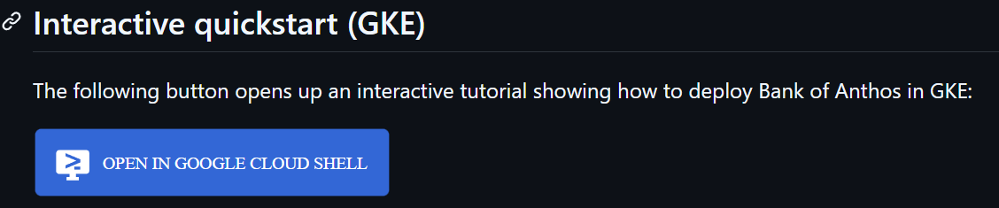

### Wczytanie środowiska i utworzenie projektu

Należy chwilę odczekać, aż wszystkie wymagane komponenty się wczytają.

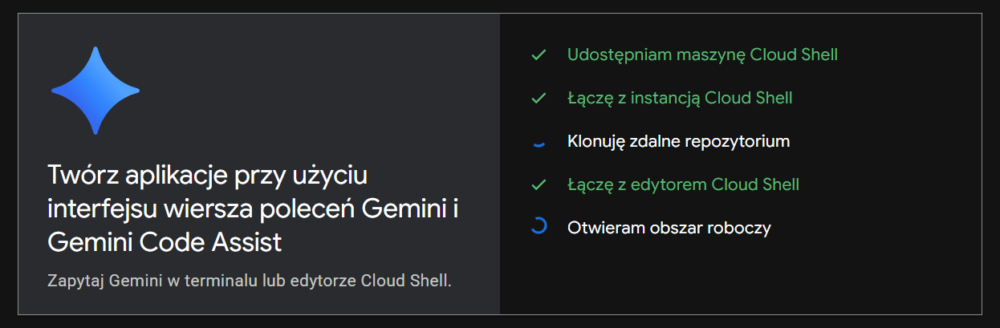

Następnie główną część obszaru roboczego zajmuje Cloud Shell Editor, w którym w następnych krokach będziemy wykonywać właściwe akcje, a w panelu po prawej stronie otwiera się interaktywny samouczek.
Wybieramy z jego poziomu "Utwórz nowy projekt".

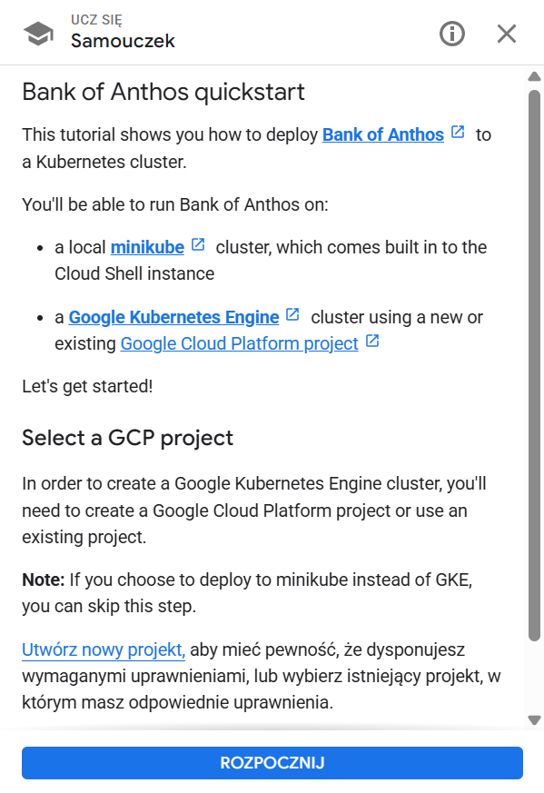

W nowo otwartym oknie podajemy nazwę projektu i wybieramy "Utwórz".

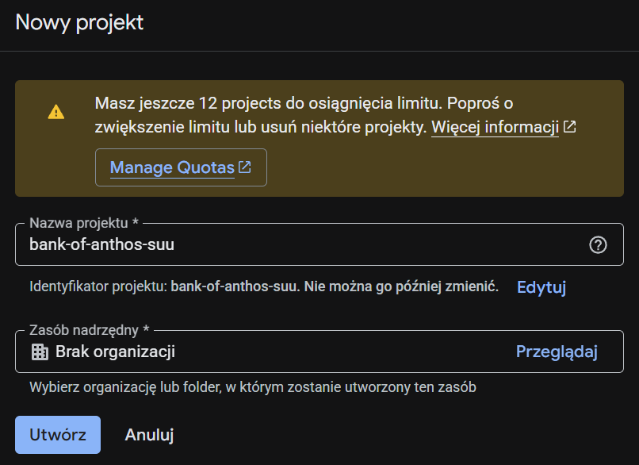

Po utworzeniu projektu zaznaczamy go w liście wyboru i klikamy "Rozpocznij".

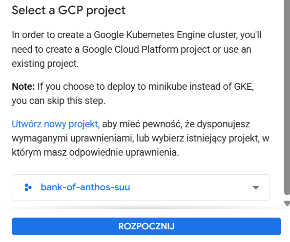

### Konfiguracja klastra Kubernetesa

Postępujemy zgodnie z instrukcjami zawartymi w panelu po prawej stronie.
Zgodnie ze wcześniejszym opisem, wykorzystujemy Google Kubernetes Engine.

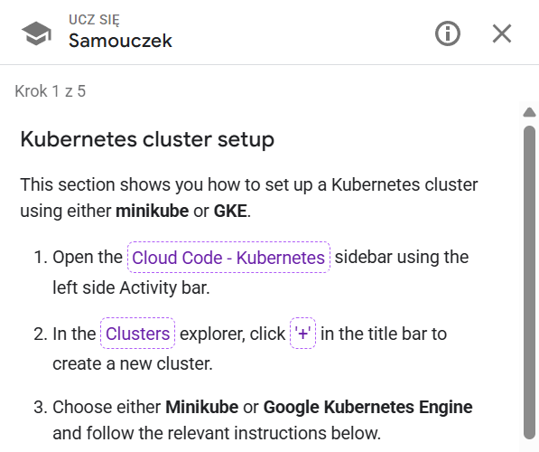

Wykonujemy wskazane kroki z odpowiedniej sekcji instrukcji, zilustrowanej poniżej.
Następnie wybieramy "Dalej".

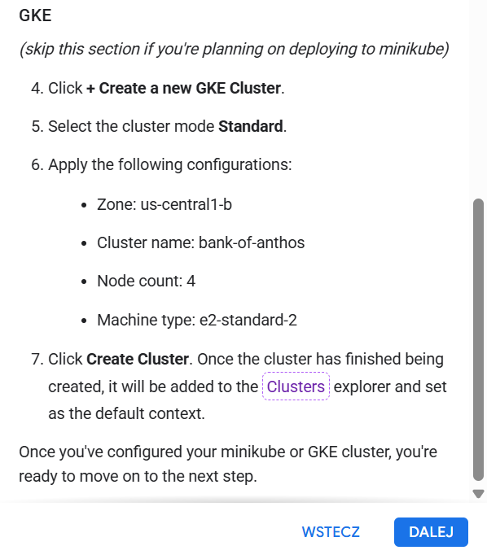

**UWAGA!**
Aby zmieścić się w limitach w ramach oferowanych bezpłatnych zasobów GCP, zmieniliśmy niektóre ustawienia:

- Node count: 3 zamiast 4,
- Machine type: _e2-medium_ zamiast _e2-standard-2_,
- Rozmiar dysku rozruchowego (w ustawieniach puli węzłów): 30GB zamiast 100GB.

### Wdrożenie tokenu JWT

Kolejnym krokiem jest wdrożenie tokenu JWT (JSON Web Token), który jest wykorzystywany przy tworzeniu kont użytkowników i ich autentykacji.

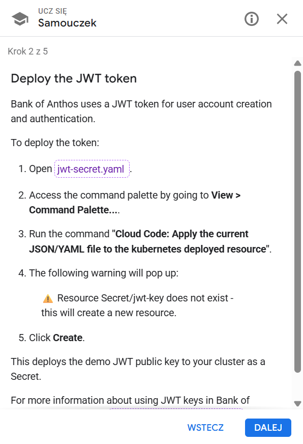

Zawartość pliku `jwt-secret.yaml` (bez kluczy):

```yaml
# Copyright 2020 Google LLC
#
# Licensed under the Apache License, Version 2.0 (the "License");
# you may not use this file except in compliance with the License.
# You may obtain a copy of the License at
#
#      http://www.apache.org/licenses/LICENSE-2.0
#
# Unless required by applicable law or agreed to in writing, software
# distributed under the License is distributed on an "AS IS" BASIS,
# WITHOUT WARRANTIES OR CONDITIONS OF ANY KIND, either express or implied.
# See the License for the specific language governing permissions and
# limitations under the License.

# This secret contains a keypair used to sign and verify JWTs for authentication
# In practice, this should never be checked into version control. It is provided here to simplify deployment
apiVersion: v1
kind: Secret
metadata:
  name: jwt-key
type: Opaque
data:
  jwtRS256.key: [REDACTED]
  jwtRS256.key.pub: [REDACTED]
```

### Uruchomienie aplikacji w klastrze Kubernetesa

Teraz możemy przejść do uruchomienia aplikacji Bank of Anthos w utworzonym wcześniej klastrze Kubernetesa.

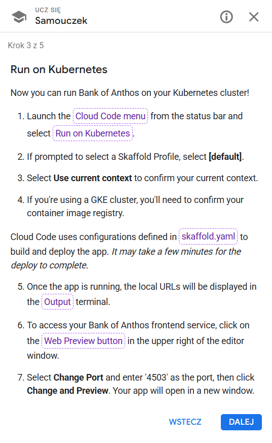

Zawartość wspomnianego pliku `skaffold.yaml`:

```yaml
# Copyright 2022 Google LLC
#
# Licensed under the Apache License, Version 2.0 (the "License");
# you may not use this file except in compliance with the License.
# You may obtain a copy of the License at
#
#      http://www.apache.org/licenses/LICENSE-2.0
#
# Unless required by applicable law or agreed to in writing, software
# distributed under the License is distributed on an "AS IS" BASIS,
# WITHOUT WARRANTIES OR CONDITIONS OF ANY KIND, either express or implied.
# See the License for the specific language governing permissions and
# limitations under the License.
apiVersion: skaffold/v4beta1
kind: Config
metadata:
  name: bank-of-anthos
requires:
- configs:
  - accounts
  path: src/accounts/skaffold.yaml
- configs:
  - ledger
  path: src/ledger/skaffold.yaml
- configs:
  - frontend
  path: src/frontend/skaffold.yaml
- configs:
  - loadgenerator
  path: src/loadgenerator/skaffold.yaml
- configs:
  - accounts-db
  path: src/accounts/accounts-db/skaffold.yaml
- configs:
  - ledger-db
  path: src/ledger/ledger-db/skaffold.yaml
deploy:
  tolerateFailuresUntilDeadline: true
```

Był to ostatni "właściwy" krok do wykonania, bowiem kolejne kroki samouczka opisują sposób usuwania klastra i czyszczenia zasobów po nim, oraz przedstawiają ekran podsumowujący cały proces.

## Rozdział 7: Integracja Prometheusa, Grafany i serwera MCP

Przedstawiamy kroki, które wykonaliśmy w celu zbierania metryk z działającej aplikacji, wizualizowania ich w przystępny sposób oraz umożliwienia wykorzystania modelu LLM do pobierania udostępnionych informacji poprzez zapytania w języku naturalnym.

### Integracja Prometheusa

Aby zainstalować Prometheusa na klastrze, należy wykonać instrukcje:

```
> helm repo add prometheus-community https://prometheus-community.github.io/helm-charts
> helm repo update
> helm install monitoring prometheus-community/kube-prometheus-stack --namespace monitoring
> helm install blackbox prometheus-community/prometheus-blackbox-exporter --namespace monitoring
```

Następnie konieczne były zmiany domyślnych wartości w plikach `probes.yaml` oraz `rules.yaml`, aby dostosować je do konkretnych wartości wykorzystywanych w naszym stosie technologicznym.

**Plik** `probes.yaml`:

```yaml
# Copyright 2023 Google LLC
#
# Licensed under the Apache License, Version 2.0 (the "License");
# you may not use this file except in compliance with the License.
# You may obtain a copy of the License at
#
#      http://www.apache.org/licenses/LICENSE-2.0
#
# Unless required by applicable law or agreed to in writing, software
# distributed under the License is distributed on an "AS IS" BASIS,
# WITHOUT WARRANTIES OR CONDITIONS OF ANY KIND, either express or implied.
# See the License for the specific language governing permissions and
# limitations under the License.
---
apiVersion: monitoring.coreos.com/v1
kind: Probe
metadata:
  name: frontend-probe
# Dodanie label monitoringu:
# labels:
#   release: monitoring
spec:
  jobName: frontend
  prober:
    url: tutorial-kube-prometheus-blackbox-exporter:19115 # zmiana na: blackbox-prometheus-blackbox-exporter.monitoring.svc.cluster.local:9115
    path: /probe
  module: http_2xx
  interval: 60s
  scrapeTimeout: 30s
  targets:
    staticConfig:
      labels:
        app: bank-of-anthos
      static:
        - frontend:80 # zmiana na: frontend.default.svc.cluster.local:80
---
apiVersion: monitoring.coreos.com/v1
kind: Probe
metadata:
  name: userservice-probe
# Dodanie label monitoringu:
# labels:
#   release: monitoring
spec:
  jobName: userservice
  prober:
    url: tutorial-kube-prometheus-blackbox-exporter:19115 # zmiana na: blackbox-prometheus-blackbox-exporter.monitoring.svc.cluster.local:9115
    path: /probe
  module: http_2xx
  interval: 60s
  scrapeTimeout: 30s
  targets:
    staticConfig:
      labels:
        app: bank-of-anthos
      static:
        - userservice:8080/ready # zmiana na: userservice.default.svc.cluster.local:8080/ready
---
apiVersion: monitoring.coreos.com/v1
kind: Probe
metadata:
  name: balancereader-probe
# Dodanie label monitoringu:
# labels:
#   release: monitoring
spec:
  jobName: balancereader
  prober:
    url: tutorial-kube-prometheus-blackbox-exporter:19115 # zmiana na: blackbox-prometheus-blackbox-exporter.monitoring.svc.cluster.local:9115
    path: /probe
  module: http_2xx
  interval: 60s
  scrapeTimeout: 30s
  targets:
    staticConfig:
      labels:
        app: bank-of-anthos
      static:
        - balancereader:8080/ready # zmiana na: balancereader.default.svc.cluster.local:8080/ready
---
apiVersion: monitoring.coreos.com/v1
kind: Probe
metadata:
  name: contacts-probe
# Dodanie label monitoringu:
# labels:
#   release: monitoring
spec:
  jobName: contacts
  prober:
    url: tutorial-kube-prometheus-blackbox-exporter:19115 # zmiana na: blackbox-prometheus-blackbox-exporter.monitoring.svc.cluster.local:9115
    path: /probe
  module: http_2xx
  interval: 60s
  scrapeTimeout: 30s
  targets:
    staticConfig:
      labels:
        app: bank-of-anthos
      static:
        - contacts:8080/ready # zmiana na: contacts.default.svc.cluster.local:8080/ready
---
apiVersion: monitoring.coreos.com/v1
kind: Probe
metadata:
  name: ledgerwriter-probe
# Dodanie label monitoringu:
# labels:
#   release: monitoring
spec:
  jobName: ledgerwriter
  prober:
    url: tutorial-kube-prometheus-blackbox-exporter:19115 # zmiana na: blackbox-prometheus-blackbox-exporter.monitoring.svc.cluster.local:9115
    path: /probe
  module: http_2xx
  interval: 60s
  scrapeTimeout: 30s
  targets:
    staticConfig:
      labels:
        app: bank-of-anthos
      static:
        - ledgerwriter:8080/ready # zmiana na: ledgerwriter.default.svc.cluster.local:8080/ready
---
apiVersion: monitoring.coreos.com/v1
kind: Probe
metadata:
  name: transactionhistory-probe
# Dodanie label monitoringu:
# labels:
#   release: monitoring
spec:
  jobName: transactionhistory
  prober:
    url: tutorial-kube-prometheus-blackbox-exporter:19115 # zmiana na: blackbox-prometheus-blackbox-exporter.monitoring.svc.cluster.local:9115
    path: /probe
  module: http_2xx
  interval: 60s
  scrapeTimeout: 30s
  targets:
    staticConfig:
      labels:
        app: bank-of-anthos
      static:
        - transactionhistory:8080/ready # zmiana na: transactionhistory.default.svc.cluster.local:8080/ready
```

**Plik** `rules.yaml`:

```yaml
# Copyright 2023 Google LLC
#
# Licensed under the Apache License, Version 2.0 (the "License");
# you may not use this file except in compliance with the License.
# You may obtain a copy of the License at
#
#      http://www.apache.org/licenses/LICENSE-2.0
#
# Unless required by applicable law or agreed to in writing, software
# distributed under the License is distributed on an "AS IS" BASIS,
# WITHOUT WARRANTIES OR CONDITIONS OF ANY KIND, either express or implied.
# See the License for the specific language governing permissions and
# limitations under the License.
---
apiVersion: monitoring.coreos.com/v1
kind: PrometheusRule
metadata:
  name: uptime-rule
# Dodanie label monitoringu:
# labels:
#   release: monitoring
spec:
  groups:
  - name: Micro services uptime
    interval: 60s
    rules:
    - alert: BalancereaderUnavaiable
      expr: probe_success{app="bank-of-anthos",job="balancereader"} == 0
      for: 1m
      annotations:
        summary: Balance Reader Service is unavailable
        description: Check Balance Reader pods and it's logs
      labels:
        severity: 'critical'
    - alert: ContactsUnavaiable
      expr: probe_success{app="bank-of-anthos",job="contacts"} == 0
      for: 1m
      annotations:
        summary: Contacs Service is unavailable
        description: Check Contacs pods and it's logs
      labels:
        severity: 'warning'
    - alert: FrontendUnavaiable
      expr: probe_success{app="bank-of-anthos",job="frontend"} == 0
      for: 1m
      annotations:
        summary: Frontend Service is unavailable
        description: Check Frontend pods and it's logs
      labels:
        severity: 'critical'
    - alert: LedgerwriterUnavaiable
      expr: probe_success{app="bank-of-anthos",job="ledgerwriter"} == 0
      for: 1m
      annotations:
        summary: Ledger Writer Service is unavailable
        description: Check Ledger Writer pods and it's logs
      labels:
        severity: 'critical'
    - alert: TransactionhistoryUnavaiable
      expr: probe_success{app="bank-of-anthos",job="transactionhistory"} == 0
      for: 1m
      annotations:
        summary: Transaction History Service is unavailable
        description: Check Transaction History pods and it's logs
      labels:
        severity: 'critical'
    - alert: UserserviceUnavaiable
      expr: probe_success{app="bank-of-anthos",job="userservice"} == 0
      for: 1m
      annotations:
        summary: User Service is unavailable
        description: Check User Service pods and it's logs
      labels:
        severity: 'critical'
```

Po odpowiednim przygotowaniu powyższych plików aplikujemy je:

```
> kubectl -n monitoring apply -f bank-of-anthos/extras/prometheus/oss/probes.yaml
> kubectl -n monitoring apply -f bank-of-anthos/extras/prometheus/oss/rules.yaml
```

### Integracja Grafany

Najpierw udostępniliśmy Grafanę z wykorzystaniem Load Balancera:

```
> kubectl -n monitoring patch svc monitoring-grafana -p '{"spec":{"type":"LoadBalancer"}}'
```

Prometheus jest automatycznie przyłączony jako data source Grafany i zbierane metryki są w niej dostępne bez dodatkowej konfiguracji.

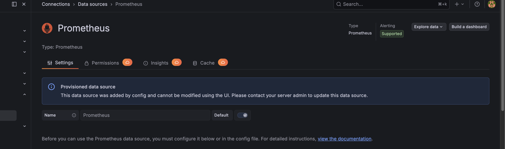

Następnie przygotowaliśmy i zaimportowaliśmy dashboard, który pozwala na bieżąco śledzić kondycję wszystkich mikroserwisów Bank of Anthos.
Wyświetla on dostępność każdego z nich, czas odpowiedzi oraz zwracany kod HTTP, a w ramach uzupełnienia także zużycie zasobów ich podów - CPU, pamięć i liczbę restartów.

```json
{
  "title": "Bank of Anthos",
  "uid": "bank-of-anthos",
  "tags": ["bank-of-anthos"],
  "timezone": "browser",
  "schemaVersion": 39,
  "refresh": "30s",
  "time": {"from": "now-1h", "to": "now"},
  "templating": {
    "list": [
      {
        "name": "datasource",
        "type": "datasource",
        "query": "prometheus",
        "current": {"text": "Prometheus", "value": "Prometheus"},
        "hide": 0
      }
    ]
  },
  "panels": [
    {
      "id": 1,
      "type": "stat",
      "title": "Service Up",
      "gridPos": {"x": 0, "y": 0, "w": 24, "h": 4},
      "datasource": {"type": "prometheus", "uid": "${datasource}"},
      "targets": [
        {"expr": "probe_success{app=\"bank-of-anthos\"}", "legendFormat": "{{job}}", "refId": "A"}
      ],
      "fieldConfig": {
        "defaults": {
          "mappings": [
            {"type": "value", "options": {"0": {"text": "DOWN", "color": "red"}, "1": {"text": "UP", "color": "green"}}}
          ],
          "thresholds": {"mode": "absolute", "steps": [{"color": "red", "value": null}, {"color": "green", "value": 1}]},
          "color": {"mode": "thresholds"}
        }
      },
      "options": {"reduceOptions": {"calcs": ["lastNotNull"]}, "colorMode": "background", "graphMode": "none"}
    },
    {
      "id": 2,
      "type": "timeseries",
      "title": "Availability over time",
      "gridPos": {"x": 0, "y": 4, "w": 12, "h": 8},
      "datasource": {"type": "prometheus", "uid": "${datasource}"},
      "targets": [
        {"expr": "probe_success{app=\"bank-of-anthos\"}", "legendFormat": "{{job}}", "refId": "A"}
      ],
      "fieldConfig": {"defaults": {"min": 0, "max": 1, "unit": "short"}}
    },
    {
      "id": 3,
      "type": "timeseries",
      "title": "Probe latency",
      "gridPos": {"x": 12, "y": 4, "w": 12, "h": 8},
      "datasource": {"type": "prometheus", "uid": "${datasource}"},
      "targets": [
        {"expr": "probe_duration_seconds{app=\"bank-of-anthos\"}", "legendFormat": "{{job}}", "refId": "A"}
      ],
      "fieldConfig": {"defaults": {"unit": "s"}}
    },
    {
      "id": 4,
      "type": "timeseries",
      "title": "HTTP status code per service",
      "gridPos": {"x": 0, "y": 12, "w": 12, "h": 8},
      "datasource": {"type": "prometheus", "uid": "${datasource}"},
      "targets": [
        {"expr": "probe_http_status_code{app=\"bank-of-anthos\"}", "legendFormat": "{{job}}", "refId": "A"}
      ]
    },
    {
      "id": 5,
      "type": "timeseries",
      "title": "DNS lookup time (probe)",
      "gridPos": {"x": 12, "y": 12, "w": 12, "h": 8},
      "datasource": {"type": "prometheus", "uid": "${datasource}"},
      "targets": [
        {"expr": "probe_dns_lookup_time_seconds{app=\"bank-of-anthos\"}", "legendFormat": "{{job}}", "refId": "A"}
      ],
      "fieldConfig": {"defaults": {"unit": "s"}}
    },
    {
      "id": 6,
      "type": "timeseries",
      "title": "Pod CPU (default ns)",
      "gridPos": {"x": 0, "y": 20, "w": 12, "h": 8},
      "datasource": {"type": "prometheus", "uid": "${datasource}"},
      "targets": [
        {"expr": "sum by (pod) (rate(container_cpu_usage_seconds_total{namespace=\"default\", container!=\"\", container!=\"POD\"}[5m]))", "legendFormat": "{{pod}}", "refId": "A"}
      ],
      "fieldConfig": {"defaults": {"unit": "short"}}
    },
    {
      "id": 7,
      "type": "timeseries",
      "title": "Pod memory (default ns)",
      "gridPos": {"x": 12, "y": 20, "w": 12, "h": 8},
      "datasource": {"type": "prometheus", "uid": "${datasource}"},
      "targets": [
        {"expr": "sum by (pod) (container_memory_working_set_bytes{namespace=\"default\", container!=\"\", container!=\"POD\"})", "legendFormat": "{{pod}}", "refId": "A"}
      ],
      "fieldConfig": {"defaults": {"unit": "bytes"}}
    },
    {
      "id": 8,
      "type": "timeseries",
      "title": "Pod restarts (default ns)",
      "gridPos": {"x": 0, "y": 28, "w": 24, "h": 6},
      "datasource": {"type": "prometheus", "uid": "${datasource}"},
      "targets": [
        {"expr": "sum by (pod) (kube_pod_container_status_restarts_total{namespace=\"default\"})", "legendFormat": "{{pod}}", "refId": "A"}
      ]
    }
  ]
}
```

### Integracja serwera MCP

Poniżej opisane są kolejne czynności wykonane w celu integracji serwera MCP z Grafaną.

1. Pobranie hasła do dashboardu Grafany

```
> kubectl get secret monitoring-grafana -n monitoring -o jsonpath="{.data.admin-password}" | base64 --decode ; echo
```

2. Dodanie Grafany MCP

W zawartej poniżej komendzie `<GRAFANA_API_KEY>` to klucz powiązany z kontem dla serwisu `mcp`.

```
> brew install helm
> helm repo add grafana-community https://grafana-community.github.io/helm-charts
> helm repo update
> helm install grafana-mcp grafana-community/grafana-mcp --namespace monitoring --set grafana.url=http://monitoring-grafana.monitoring.svc.cluster.local --set grafana.apiKey=<GRAFANA_API_KEY>
```

3. Połączenie z Claude Desktop

```
> kubectl port-forward svc/grafana-mcp 8000:8000 -n monitoring
> npx mcp-remote http://localhost:8000/sse
```

Następnie należy otworzyć plik `claude_desktop_config.json` i dodać na końcu:

```json
{

	... dotychczasowa zawartość ...

	"mcpServers": {
	  "grafana": {
	    "command": "npx",
	    "args": [
	      "mcp-remote",
	      "http://localhost:8000/sse"
	    ]
	  }
	}
}
```

Po zrestartowaniu aplikacji Claude Desktop 
wtyczka `grafana` powinna być domyślnie włączona.

## Rozdział 8: Przedstawienie działania aplikacji

### Przebieg wykonania

### Wyniki

## Rozdział 9: Podsumowanie i wnioski

## Rozdział 10: Referencje
